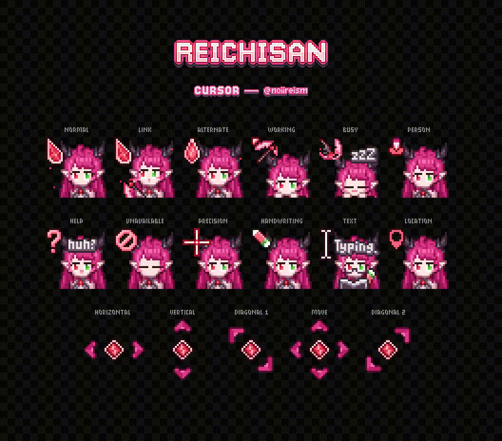

# waifu-cursors

✨ A collection of cute waifu cursor themes for Linux (X11/Wayland).  
Each theme can be installed individually or all together using Nix flakes or manual methods.

---

## 🎥 Preview





---

## 🚀 Usage

### With Nix flakes

Add this flake as an input in your system or Home Manager configuration:

```nix
{
  inputs.waifu-cursors.url = "github:maotseantonio/waifu-cursors";
}
```

Install **all themes**:
```nix
environment.systemPackages = [
  inputs.waifu-cursors.packages.${pkgs.system}.all
];
```

Or install **individual themes**:
```nix
environment.systemPackages = [
  inputs.waifu-cursors.packages.${pkgs.system}.Hoshimi-Miyami
  inputs.waifu-cursors.packages.${pkgs.system}.Imouto
  inputs.waifu-cursors.packages.${pkgs.system}.Kirispica
  inputs.waifu-cursors.packages.${pkgs.system}.Menace-Mamaki
  inputs.waifu-cursors.packages.${pkgs.system}.miku-cursor-linux
  inputs.waifu-cursors.packages.${pkgs.system}.Reichi-Shinigami
];
```

---

Bonus for SDDM Themes:
```nix
    environment.systemPackages = [
      inputs.waifu-cursors.packages.${pkgs.system}.Reichi-Shinigami
      inputs.sddm-stray.packages.${pkgs.system}.default
    ];

    services.xserver.enable = true;
    services.displayManager.defaultSession = "hyprland-uwsm";
    services.displayManager.sddm = {
      enable = true; # Enable SDDM.
      package = pkgs.kdePackages.sddm;
      extraPackages = with pkgs; [
        kdePackages.qtsvg
        kdePackages.qtmultimedia
        kdePackages.qtvirtualkeyboard
      ];
      wayland.enable = true;
      theme = "sddm-theme-stray";
      settings = {
        Theme = {
          CursorTheme = "Reichi-Shinigami";
        };
      };
    };
```
---

## 💖 Credits

Please support the original artists behind these wonderful cursors:

- [imouto-mouse](https://www.patreon.com/posts/imouto-mouse-132246997)
- [miku-cursors](https://github.com/supermariofps/hatsune-miku-windows-linux-cursors)
- [Reichi-Shinigami](https://www.naturl.link/o4jIFH)
- [Menace-Mamaki](https://ko-fi.com/s/b719ffa6c8)
- [Kirispica](https://ko-fi.com/s/5be320794d)

---

## 💡 Notes

- This cursor is mostly for nixos with hyprland and niri other de and wm should work but i dont test
- Wayland + X11 supported
- You can set as SDDM cursor theme via your display manager config
